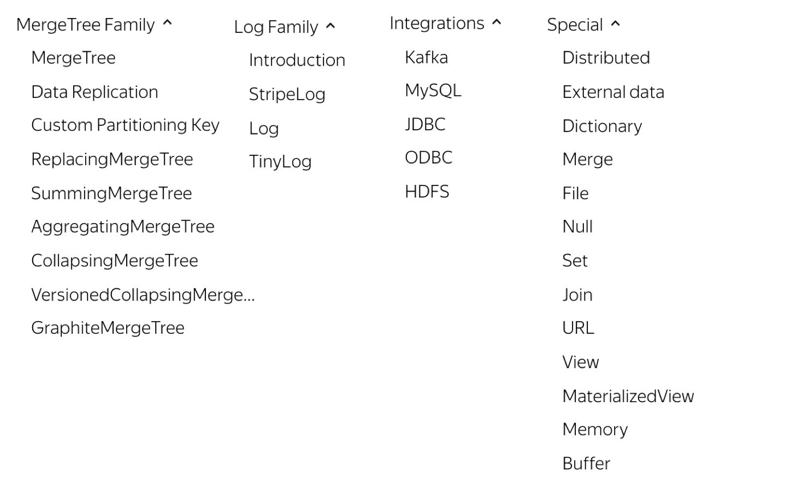

* [如何选择clickhouse表引擎](#如何选择clickhouse表引擎)
  * [背景信息](#背景信息)
  * [ClickHouse表引擎概览](#clickhouse表引擎概览)
  * [Log系列](#log系列)
  * [Integration系列](#integration系列)
  * [Special系列](#special系列)
  * [MergeTree系列](#mergetree系列)
  * [总结](#总结)


# 如何选择clickhouse表引擎

## 背景信息

表引擎在ClickHouse中的作用十分关键，直接决定了数据如何存储和读取、是否支持并发读写、是否支持index、支持的query种类、是否支持主备复制等。

ClickHouse提供了大约28种表引擎，各有各的用途，比如有Lo系列用来做小表数据分析，MergeTree系列用来做大数据量分析，而Integration系列则多用于外表数据集成。再考虑复制表Replicated系列，分布式表Distributed等，纷繁复杂，新用户上手选择时常常感到迷惑。

本文尝试对ClickHouse的表引擎进行梳理，帮忙大家快速入门ClickHouse。

## ClickHouse表引擎概览

下图是ClickHouse提供的所有表引擎汇总。

[](https://static-aliyun-doc.oss-accelerate.aliyuncs.com/assets/img/zh-CN/1523283851/p88863.png)`%ClickHouse表引擎一共分为四个系列，分别是Log、MergeTree、Integration、Special。其中包含了两种特殊的表引擎Replicated、Distributed，功能上与其他表引擎正交，根据场景组合使用。;`

## Log系列

Log系列表引擎功能相对简单，主要用于快速写入小表（1百万行左右的表），然后全部读出的场景。

几种Log表引擎的共性是：

- 数据被顺序append写到磁盘上。
- 不支持delete、update。
- 不支持index。
- 不支持原子性写。
- insert会阻塞select操作。

它们彼此之间的区别是：

- TinyLog：不支持并发读取数据文件，查询性能较差；格式简单，适合用来暂存中间数据。
- StripLog：支持并发读取数据文件，查询性能比TinyLog好；将所有列存储在同一个大文件中，减少了文件个数。
- Log：支持并发读取数据文件，查询性能比TinyLog好；每个列会单独存储在一个独立文件中。

## Integration系列

该系统表引擎主要用于将外部数据导入到ClickHouse中，或者在ClickHouse中直接操作外部数据源。

- Kafka：将Kafka Topic中的数据直接导入到ClickHouse。
- MySQL：将Mysql作为存储引擎，直接在ClickHouse中对MySQL表进行select等操作。
- JDBC/ODBC：通过指定jdbc、odbc连接串读取数据源。
- HDFS：直接读取HDFS上的特定格式的数据文件；

## Special系列

Special系列的表引擎，大多是为了特定场景而定制的。这里也挑选几个简单介绍，不做详述。

- Memory：将数据存储在内存中，重启后会导致数据丢失。查询性能极好，适合于对于数据持久性没有要求的1亿以下的小表。在ClickHouse中，通常用来做临时表。
- Buffer：为目标表设置一个内存buffer，当buffer达到了一定条件之后会flush到磁盘。
- File：直接将本地文件作为数据存储。
- Null：写入数据被丢弃、读取数据为空。

## MergeTree系列

Log、Special、Integration主要用于特殊用途，场景相对有限。MergeTree系列才是官方主推的存储引擎，支持几乎所有ClickHouse核心功能。

以下重点介绍MergeTree、ReplacingMergeTree、CollapsingMergeTree、VersionedCollapsingMergeTree、SummingMergeTree、AggregatingMergeTree引擎。

***\*MergeTree\****

MergeTree表引擎主要用于海量数据分析，支持数据分区、存储有序、主键索引、稀疏索引、数据TTL等。MergeTree支持所有ClickHouse SQL语法，但是有些功能与MySQL并不一致，比如在MergeTree中主键并不用于去重，以下通过示例说明。

如下建表DDL所示，test_tbl的主键为(id, create_time)，并且按照主键进行存储排序，按照create_time进行数据分区，数据保留最近一个月。

```sql
CREATE TABLE test_tbl (
  id UInt16,
  create_time Date,
  comment Nullable(String)
) ENGINE = MergeTree()
   PARTITION BY create_time
     ORDER BY  (id, create_time)
     PRIMARY KEY (id, create_time)
     TTL create_time + INTERVAL 1 MONTH
     SETTINGS index_granularity=8192;
```

写入数据：值得注意的是这里我们写入了几条primary key相同的数据。

```sql
insert into test_tbl values(0, '2019-12-12', null);
insert into test_tbl values(0, '2019-12-12', null);
insert into test_tbl values(1, '2019-12-13', null);
insert into test_tbl values(1, '2019-12-13', null);
insert into test_tbl values(2, '2019-12-14', null);
```

查询数据： 可以看到虽然主键id、create_time相同的数据只有3条数据，但是结果却有5行。

```sql
select count(*) from test_tbl;
┌─count()─┐
│       5 │
└─────────┘

select * from test_tbl;
┌─id─┬─create_time─┬─comment─┐
│  2 │  2019-12-14 │ ᴺᵁᴸᴸ    │
└────┴─────────────┴─────────┘
┌─id─┬─create_time─┬─comment─┐
│  1 │  2019-12-13 │ ᴺᵁᴸᴸ    │
└────┴─────────────┴─────────┘
┌─id─┬─create_time─┬─comment─┐
│  0 │  2019-12-12 │ ᴺᵁᴸᴸ    │
└────┴─────────────┴─────────┘
┌─id─┬─create_time─┬─comment─┐
│  1 │  2019-12-13 │ ᴺᵁᴸᴸ    │
└────┴─────────────┴─────────┘
┌─id─┬─create_time─┬─comment─┐
│  0 │  2019-12-12 │ ᴺᵁᴸᴸ    │
└────┴─────────────┴─────────┘
```

由于MergeTree采用类似LSM tree的结构，很多存储层处理逻辑直到Compaction期间才会发生。因此强制后台compaction执行完毕，再次查询，发现仍旧有5条数据。

```sql
optimize table test_tbl final;


select count(*) from test_tbl;
┌─count()─┐
│       5 │
└─────────┘

select * from test_tbl;
┌─id─┬─create_time─┬─comment─┐
│  2 │  2019-12-14 │ ᴺᵁᴸᴸ    │
└────┴─────────────┴─────────┘
┌─id─┬─create_time─┬─comment─┐
│  0 │  2019-12-12 │ ᴺᵁᴸᴸ    │
│  0 │  2019-12-12 │ ᴺᵁᴸᴸ    │
└────┴─────────────┴─────────┘
┌─id─┬─create_time─┬─comment─┐
│  1 │  2019-12-13 │ ᴺᵁᴸᴸ    │
│  1 │  2019-12-13 │ ᴺᵁᴸᴸ    │
└────┴─────────────┴─────────┘
```

结合以上示例可以看到，MergeTree虽然有主键索引，但是其主要作用是加速查询，而不是类似MySQL等数据库用来保持记录唯一。即便在Compaction完成后，主键相同的数据行也仍旧共同存在。

***\*ReplacingMergeTree\****

为了解决MergeTree相同主键无法去重的问题，ClickHouse提供了ReplacingMergeTree引擎，用来做去重。

示例如下：

```sql
-- 建表
CREATE TABLE test_tbl_replacing (
  id UInt16,
  create_time Date,
  comment Nullable(String)
) ENGINE = ReplacingMergeTree()
   PARTITION BY create_time
     ORDER BY  (id, create_time)
     PRIMARY KEY (id, create_time)
     TTL create_time + INTERVAL 1 MONTH
     SETTINGS index_granularity=8192;

-- 写入主键重复的数据
insert into test_tbl_replacing values(0, '2019-12-12', null);
insert into test_tbl_replacing values(0, '2019-12-12', null);
insert into test_tbl_replacing values(1, '2019-12-13', null);
insert into test_tbl_replacing values(1, '2019-12-13', null);
insert into test_tbl_replacing values(2, '2019-12-14', null);

-- 查询，可以看到未compaction之前，主键重复的数据，仍旧存在。
select count(*) from test_tbl_replacing;
┌─count()─┐
│       5 │
└─────────┘

select * from test_tbl_replacing;
┌─id─┬─create_time─┬─comment─┐
│  0 │  2019-12-12 │ ᴺᵁᴸᴸ    │
└────┴─────────────┴─────────┘
┌─id─┬─create_time─┬─comment─┐
│  0 │  2019-12-12 │ ᴺᵁᴸᴸ    │
└────┴─────────────┴─────────┘
┌─id─┬─create_time─┬─comment─┐
│  1 │  2019-12-13 │ ᴺᵁᴸᴸ    │
└────┴─────────────┴─────────┘
┌─id─┬─create_time─┬─comment─┐
│  1 │  2019-12-13 │ ᴺᵁᴸᴸ    │
└────┴─────────────┴─────────┘
┌─id─┬─create_time─┬─comment─┐
│  2 │  2019-12-14 │ ᴺᵁᴸᴸ    │
└────┴─────────────┴─────────┘


-- 强制后台compaction：
optimize table test_tbl_replacing final;


-- 再次查询：主键重复的数据已经消失。
select count(*) from test_tbl_replacing;
┌─count()─┐
│       3 │
└─────────┘

select * from test_tbl_replacing;
┌─id─┬─create_time─┬─comment─┐
│  2 │  2019-12-14 │ ᴺᵁᴸᴸ    │
└────┴─────────────┴─────────┘
┌─id─┬─create_time─┬─comment─┐
│  1 │  2019-12-13 │ ᴺᵁᴸᴸ    │
└────┴─────────────┴─────────┘
┌─id─┬─create_time─┬─comment─┐
│  0 │  2019-12-12 │ ᴺᵁᴸᴸ    │
└────┴─────────────┴─────────┘
```

虽然ReplacingMergeTree提供了主键去重的能力，但是仍旧有以下限制：

- 在没有彻底optimize之前，可能无法达到主键去重的效果，比如部分数据已经被去重，而另外一部分数据仍旧有主键重复。
- 在分布式场景下，相同primary key的数据可能被sharding到不同节点上，不同shard间可能无法去重。
- optimize是后台动作，无法预测具体执行时间点。
- 手动执行optimize在海量数据场景下要消耗大量时间，无法满足业务即时查询的需求。

因此ReplacingMergeTree更多被用于确保数据最终被去重，而无法保证查询过程中主键不重复。

***\*CollapsingMergeTree\****

ClickHouse实现了CollapsingMergeTree来消除ReplacingMergeTree的功能限制。该引擎要求在建表语句中指定一个标记列Sign，后台Compaction时会将主键相同、Sign相反的行进行折叠，也即删除。

CollapsingMergeTree将行按照Sign的值分为两类：Sign=1的行称之为状态行，Sign=-1的行称之为取消行。

每次需要新增状态时，写入一行状态行；需要删除状态时，则写入一行取消行。

在后台Compaction时，状态行与取消行会自动做折叠（删除）处理。而尚未进行Compaction的数据，状态行与取消行同时存在。

因此为了能够达到主键折叠（删除）的目的，需要业务层进行适当改造：

- 执行删除操作需要写入取消行，而取消行中需要包含与原始状态行主键一样的数据（Sign列除外）。所以在应用层需要记录原始状态行的值，或者在执行删除操作前先查询数据库获取原始状态行。
- 由于后台Compaction时机无法预测，在发起查询时，状态行和取消行可能尚未被折叠；另外，ClickHouse无法保证primary key相同的行落在同一个节点上，不在同一节点上的数据无法折叠。因此在进行count(*)、sum(col)等聚合计算时，可能会存在数据冗余的情况。为了获得正确结果，业务层需要改写SQL，将count()、sum(col)分别改写为sum(Sign)、sum(col * Sign)。

以下用示例说明：

```sql
-- 建表
CREATE TABLE UAct
(
    UserID UInt64,
    PageViews UInt8,
    Duration UInt8,
    Sign Int8
)
ENGINE = CollapsingMergeTree(Sign)
ORDER BY UserID;

-- 插入状态行，注意sign一列的值为1
INSERT INTO UAct VALUES (4324182021466249494, 5, 146, 1);

-- 插入一行取消行，用于抵消上述状态行。注意sign一列的值为-1，其余值与状态行一致；
-- 并且插入一行主键相同的新状态行，用来将PageViews从5更新至6，将Duration从146更新为185.
INSERT INTO UAct VALUES (4324182021466249494, 5, 146, -1), (4324182021466249494, 6, 185, 1);

-- 查询数据：可以看到未Compaction之前，状态行与取消行共存。
SELECT * FROM UAct;
┌──────────────UserID─┬─PageViews─┬─Duration─┬─Sign─┐
│ 4324182021466249494 │         5 │      146 │   -1 │
│ 4324182021466249494 │         6 │      185 │    1 │
└─────────────────────┴───────────┴──────────┴──────┘
┌──────────────UserID─┬─PageViews─┬─Duration─┬─Sign─┐
│ 4324182021466249494 │         5 │      146 │    1 │
└─────────────────────┴───────────┴──────────┴──────┘

-- 为了获取正确的sum值，需要改写SQL： 
-- sum(PageViews) => sum(PageViews * Sign)、 
-- sum(Duration) => sum(Duration * Sign)
SELECT
    UserID,
    sum(PageViews * Sign) AS PageViews,
    sum(Duration * Sign) AS Duration
FROM UAct
GROUP BY UserID
HAVING sum(Sign) > 0;
┌──────────────UserID─┬─PageViews─┬─Duration─┐
│ 4324182021466249494 │         6 │      185 │
└─────────────────────┴───────────┴──────────┘


-- 强制后台Compaction
optimize table UAct final;

-- 再次查询，可以看到状态行、取消行已经被折叠，只剩下最新的一行状态行。
select * from UAct;
┌──────────────UserID─┬─PageViews─┬─Duration─┬─Sign─┐
│ 4324182021466249494 │         6 │      185 │    1 │
└─────────────────────┴───────────┴──────────┴──────┘
```

CollapsingMergeTree虽然解决了主键相同的数据即时删除的问题，但是状态持续变化且多线程并行写入情况下，状态行与取消行位置可能乱序，导致无法正常折叠。

如下面例子所示：

```sql
-- 建表
CREATE TABLE UAct_order
(
    UserID UInt64,
    PageViews UInt8,
    Duration UInt8,
    Sign Int8
)
ENGINE = CollapsingMergeTree(Sign)
ORDER BY UserID;

-- 先插入取消行
INSERT INTO UAct_order VALUES (4324182021466249495, 5, 146, -1);
-- 后插入状态行
INSERT INTO UAct_order VALUES (4324182021466249495, 5, 146, 1);

-- 强制Compaction
optimize table UAct_order final;

-- 可以看到即便Compaction之后也无法进行主键折叠: 2行数据仍旧都存在。
select * from UAct_order;
┌──────────────UserID─┬─PageViews─┬─Duration─┬─Sign─┐
│ 4324182021466249495 │         5 │      146 │   -1 │
│ 4324182021466249495 │         5 │      146 │    1 │
└─────────────────────┴───────────┴──────────┴──────┘
```

***\*VersionedCollapsingMergeTree\****

为了解决CollapsingMergeTree乱序写入情况下无法正常折叠问题，VersionedCollapsingMergeTree表引擎在建表语句中新增了一列Version，用于在乱序情况下记录状态行与取消行的对应关系。主键相同，且Version相同、Sign相反的行，在Compaction时会被删除。

与CollapsingMergeTree类似， 为了获得正确结果，业务层需要改写SQL，将count()、sum(col)分别改写为sum(Sign)、sum(col * Sign)。

示例如下：

```sql
-- 建表
CREATE TABLE UAct_version
(
    UserID UInt64,
    PageViews UInt8,
    Duration UInt8,
    Sign Int8,
    Version UInt8
)
ENGINE = VersionedCollapsingMergeTree(Sign, Version)
ORDER BY UserID;


-- 先插入一行取消行，注意Signz=-1, Version=1
INSERT INTO UAct_version VALUES (4324182021466249494, 5, 146, -1, 1);
-- 后插入一行状态行，注意Sign=1, Version=1；及一行新的状态行注意Sign=1, Version=2，将PageViews从5更新至6，将Duration从146更新为185。
INSERT INTO UAct_version VALUES (4324182021466249494, 5, 146, 1, 1),(4324182021466249494, 6, 185, 1, 2);


-- 查询可以看到未compaction情况下，所有行都可见。
SELECT * FROM UAct_version;
┌──────────────UserID─┬─PageViews─┬─Duration─┬─Sign─┐
│ 4324182021466249494 │         5 │      146 │   -1 │
│ 4324182021466249494 │         6 │      185 │    1 │
└─────────────────────┴───────────┴──────────┴──────┘
┌──────────────UserID─┬─PageViews─┬─Duration─┬─Sign─┐
│ 4324182021466249494 │         5 │      146 │    1 │
└─────────────────────┴───────────┴──────────┴──────┘


-- 为了获取正确的sum值，需要改写SQL： 
-- sum(PageViews) => sum(PageViews * Sign)、 
-- sum(Duration) => sum(Duration * Sign)
SELECT
    UserID,
    sum(PageViews * Sign) AS PageViews,
    sum(Duration * Sign) AS Duration
FROM UAct_version
GROUP BY UserID
HAVING sum(Sign) > 0;
┌──────────────UserID─┬─PageViews─┬─Duration─┐
│ 4324182021466249494 │         6 │      185 │
└─────────────────────┴───────────┴──────────┘


-- 强制后台Compaction
optimize table UAct_version final;


-- 再次查询，可以看到即便取消行与状态行位置乱序，仍旧可以被正确折叠。
select * from UAct_version;
┌──────────────UserID─┬─PageViews─┬─Duration─┬─Sign─┬─Version─┐
│ 4324182021466249494 │         6 │      185 │    1 │       2 │
└─────────────────────┴───────────┴──────────┴──────┴─────────┘
```

***\*SummingMergeTree\****

ClickHouse通过SummingMergeTree来支持对主键列进行预先聚合。在后台Compaction时，会将主键相同的多行进行sum求和，然后使用一行数据取而代之，从而大幅度降低存储空间占用，提升聚合计算性能。

值得注意的是：

- ClickHouse只在后台Compaction时才会进行数据的预先聚合，而compaction的执行时机无法预测，所以可能存在部分数据已经被预先聚合、部分数据尚未被聚合的情况。因此，在执行聚合计算时，SQL中仍需要使用GROUP BY子句。
- 在预先聚合时，ClickHouse会对主键列之外的其他所有列进行预聚合。如果这些列是可聚合的（比如数值类型），则直接sum；如果不可聚合（比如String类型），则随机选择一个值。
- 通常建议将SummingMergeTree与MergeTree配合使用，使用MergeTree来存储具体明细，使用SummingMergeTree来存储预先聚合的结果加速查询。

示例如下：

```sql
-- 建表
CREATE TABLE summtt
(
    key UInt32,
    value UInt32
)
ENGINE = SummingMergeTree()
ORDER BY key

-- 插入数据
INSERT INTO summtt Values(1,1),(1,2),(2,1)

-- compaction前查询，仍存在多行
select * from summtt;
┌─key─┬─value─┐
│   1 │     1 │
│   1 │     2 │
│   2 │     1 │
└─────┴───────┘

-- 通过GROUP BY进行聚合计算
SELECT key, sum(value) FROM summtt GROUP BY key
┌─key─┬─sum(value)─┐
│   2 │          1 │
│   1 │          3 │
└─────┴────────────┘

-- 强制compaction
optimize table summtt final;

-- compaction后查询，可以看到数据已经被预先聚合
select * from summtt;
┌─key─┬─value─┐
│   1 │     3 │
│   2 │     1 │
└─────┴───────┘


-- compaction后，仍旧需要通过GROUP BY进行聚合计算
SELECT key, sum(value) FROM summtt GROUP BY key
┌─key─┬─sum(value)─┐
│   2 │          1 │
│   1 │          3 │
└─────┴────────────┘
```

***\*AggregatingMergeTree\****

AggregatingMergeTree也是预先聚合引擎的一种，用于提升聚合计算的性能。与SummingMergeTree的区别在于：SummingMergeTree对非主键列进行sum聚合，而AggregatingMergeTree则可以指定各种聚合函数。

AggregatingMergeTree的语法比较复杂，需要结合物化视图或ClickHouse的特殊数据类型AggregateFunction一起使用。在insert和select时，也有独特的写法和要求：写入时需要使用-State语法，查询时使用-Merge语法。

以下通过示例进行介绍。

示例一：配合物化视图使用。

```sql
-- 建立明细表
CREATE TABLE visits
(
    UserID UInt64,
    CounterID UInt8,
    StartDate Date,
    Sign Int8
)
ENGINE = CollapsingMergeTree(Sign)
ORDER BY UserID;

-- 对明细表建立物化视图，该物化视图对明细表进行预先聚合
-- 注意：预先聚合使用的函数分别为： sumState, uniqState。对应于写入语法<agg>-State.
CREATE MATERIALIZED VIEW visits_agg_view
ENGINE = AggregatingMergeTree() PARTITION BY toYYYYMM(StartDate) ORDER BY (CounterID, StartDate)
AS SELECT
    CounterID,
    StartDate,
    sumState(Sign)    AS Visits,
    uniqState(UserID) AS Users
FROM visits
GROUP BY CounterID, StartDate;

-- 插入明细数据
INSERT INTO visits VALUES(0, 0, '2019-11-11', 1);
INSERT INTO visits VALUES(1, 1, '2019-11-12', 1);

-- 对物化视图进行最终的聚合操作
-- 注意：使用的聚合函数为 sumMerge， uniqMerge。对应于查询语法<agg>-Merge.
SELECT
    StartDate,
    sumMerge(Visits) AS Visits,
    uniqMerge(Users) AS Users
FROM visits_agg_view
GROUP BY StartDate
ORDER BY StartDate;

-- 普通函数 sum, uniq不再可以使用
-- 如下SQL会报错： Illegal type AggregateFunction(sum, Int8) of argument 
SELECT
    StartDate,
    sum(Visits),
    uniq(Users)
FROM visits_agg_view
GROUP BY StartDate
ORDER BY StartDate;
```

示例二：配合特殊数据类型AggregateFunction使用。

```sql
-- 建立明细表
CREATE TABLE detail_table
(   CounterID UInt8,
    StartDate Date,
    UserID UInt64
) ENGINE = MergeTree() 
PARTITION BY toYYYYMM(StartDate) 
ORDER BY (CounterID, StartDate);

-- 插入明细数据
INSERT INTO detail_table VALUES(0, '2019-11-11', 1);
INSERT INTO detail_table VALUES(1, '2019-11-12', 1);

-- 建立预先聚合表，
-- 注意：其中UserID一列的类型为：AggregateFunction(uniq, UInt64)
CREATE TABLE agg_table
(   CounterID UInt8,
    StartDate Date,
    UserID AggregateFunction(uniq, UInt64)
) ENGINE = AggregatingMergeTree() 
PARTITION BY toYYYYMM(StartDate) 
ORDER BY (CounterID, StartDate);

-- 从明细表中读取数据，插入聚合表。
-- 注意：子查询中使用的聚合函数为 uniqState， 对应于写入语法<agg>-State
INSERT INTO agg_table
select CounterID, StartDate, uniqState(UserID)
from detail_table
group by CounterID, StartDate

-- 不能使用普通insert语句向AggregatingMergeTree中插入数据。
-- 本SQL会报错：Cannot convert UInt64 to AggregateFunction(uniq, UInt64)
INSERT INTO agg_table VALUES(1, '2019-11-12', 1);

-- 从聚合表中查询。
-- 注意：select中使用的聚合函数为uniqMerge，对应于查询语法<agg>-Merge
SELECT uniqMerge(UserID) AS state
FROM agg_table 
GROUP BY CounterID, StartDate;
```

## 总结

ClickHouse提供了丰富多样的表引擎，应对不同的业务需求。在这些表引擎之外，ClickHouse还提供了Replicated、Distributed等高级表引擎，需要结合集群部署方式和应用场景灵活组合使用。