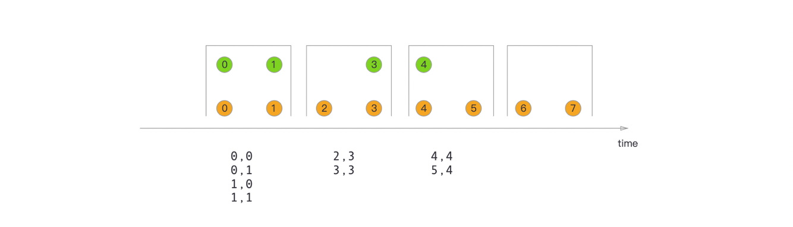
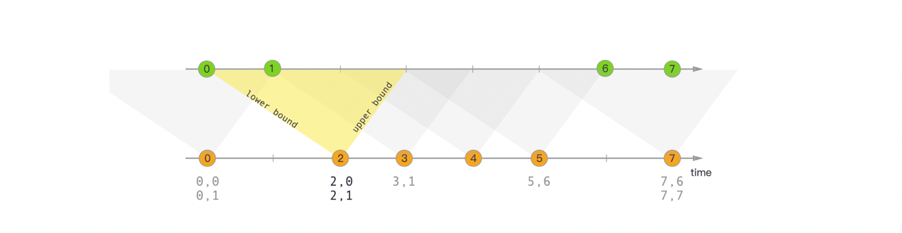

* [Streaming Joins](#streaming-joins)
  * [Window Join](#window-join)
    * [Inner Join](#inner-join)
      * [除了官方提供的API，也可以通过coGroup来实现](#除了官方提供的api也可以通过cogroup来实现)
    * [Left Join](#left-join)
    * [Right Join](#right-join)
  * [Interval Join](#interval-join)
  * [总结](#总结)

# Streaming Joins

## Window Join

基于窗口的Join是将具有相同key并位于同一个窗口中的事件进行联结。

用法：

```scala
stream.join(otherStream)
    .where(<KeySelector>)
    .equalTo(<KeySelector>)
    .window(<WindowAssigner>)
    .apply(<JoinFunction>)
```

官方案例：

Tumbling Window Join的实现，关于其他的窗口，如滑动窗口、会话窗口等，原理是一致的。



如图所示，我们定义了一个大小为2毫秒的滚动窗口，该窗口的形式为[0,1], [2,3], ...。该图显示了每个窗口中所有元素的成对组合，这些元素将传递给JoinFunction。注意，在翻转窗口中[6,7]什么也不发射，因为在绿色流中不存在要与橙色元素⑥和joined连接的元素。

### Inner Join

与SQL中的Inner Join语义是一致的，将具有相同key并在同一个窗口中的事件Join，注意是key能完全匹配上才能Join上。

Flink API中的stream.join(otherStream)正是实现的Inner Join。

以电商中的订单双流Join为例，定义两个输入流和一个Join后的输出流

```scala
// 两个订单流，测试双流Join
case class OrderLogEvent1(orderId:Long,amount:Double,timeStamp:Long)
case class OrderLogEvent2(orderId:Long,itemId:Long,timeStamp:Long)
case class OrderResultEvent(orderId:Long,amount:Double,itemId:Long)
```

为了测试方便，直接读取两个集合中的数据，定义流事件

```scala
    val leftOrderStream = env.fromCollection(List(
      OrderLogEvent1(1L, 22.1, DateUtils.getTime("2020-04-29 13:01")),
      OrderLogEvent1(2L, 22.2, DateUtils.getTime("2020-04-29 13:03")),
      OrderLogEvent1(4L, 22.3, DateUtils.getTime("2020-04-29 13:04")),
      OrderLogEvent1(4L, 22.4, DateUtils.getTime("2020-04-29 13:05")),
      OrderLogEvent1(5L, 22.5, DateUtils.getTime("2020-04-29 13:07")),
      OrderLogEvent1(6L, 22.6, DateUtils.getTime("2020-04-29 13:09"))
    ))
      .assignTimestampsAndWatermarks(new BoundedOutOfOrdernessTimestampExtractor[OrderLogEvent1](Time.seconds(5)) {
        override def extractTimestamp(element: OrderLogEvent1): Long = element.timeStamp
      })
      .keyBy(_.orderId)

    val rightOrderStream = env.fromCollection(List(
      OrderLogEvent2(1L, 121, DateUtils.getTime("2020-04-29 13:01")),
      OrderLogEvent2(2L, 122, DateUtils.getTime("2020-04-29 13:03")),
      OrderLogEvent2(3L, 123, DateUtils.getTime("2020-04-29 13:04")),
      OrderLogEvent2(4L, 124, DateUtils.getTime("2020-04-29 13:05")),
      OrderLogEvent2(5L, 125, DateUtils.getTime("2020-04-29 13:07")),
      OrderLogEvent2(7L, 126, DateUtils.getTime("2020-04-29 13:09"))
    ))
      .assignTimestampsAndWatermarks(new BoundedOutOfOrdernessTimestampExtractor[OrderLogEvent2](Time.seconds(5)) {
        override def extractTimestamp(element: OrderLogEvent2): Long = element.timeStamp
      })
      .keyBy(_.orderId)
```

Join实现：

```scala
 leftOrderStream
          .join(rightOrderStream)
          .where(_.orderId)
          .equalTo(_.orderId)
          .window(TumblingEventTimeWindows.of(Time.minutes(5))) // 5min的时间滚动窗口
          .apply(new InnerWindowJoinFunction)
          .print()
          
class InnerWindowJoinFunction extends JoinFunction[OrderLogEvent1, OrderLogEvent2, OrderResultEvent] {
  override def join(first: OrderLogEvent1, second: OrderLogEvent2): OrderResultEvent = {
    OrderResultEvent(first.orderId, first.amount, second.itemId)
  }
}
```

测试输出结果：

```scala
OrderResultEvent(1,22.1,121)
OrderResultEvent(2,22.2,122)
OrderResultEvent(5,22.5,125)
OrderResultEvent(4,22.4,124)
```

可见实现了基于Window的Inner Join。

#### 除了官方提供的API，也可以通过coGroup来实现

**coGroup**:

该操作是将两个数据流/集合按照key进行group，然后将相同key的数据进行处理，但是它和join操作稍有区别，它在一个流/数据集中没有找到与另一个匹配的数据还是会输出。

coGroup的用法类似于Join，不同的是在apply中传入的是一个CoGroupFunction，而不是JoinFunction

```scala
val coGroupedStream = leftOrderStream
      .coGroup(rightOrderStream)
      .where(_.orderId)
      .equalTo(_.orderId)
      .window(TumblingEventTimeWindows.of(Time.minutes(5))) // 5min的时间滚动窗口
```

Inner Join实现

```scala
 coGroupedStream.apply(new InnerWindowJoinFunction).print()
 
 class InnerWindowJoinFunction extends CoGroupFunction[OrderLogEvent1,OrderLogEvent2,OrderResultEvent]{
  override def coGroup(first: java.lang.Iterable[OrderLogEvent1],
                       second: java.lang.Iterable[OrderLogEvent2],
                       out: Collector[OrderResultEvent]): Unit = {
    /**
     * 将Java的Iterable对象转化为Scala的Iterable对象
     */
    import scala.collection.JavaConverters._
    val scalaT1 = first.asScala.toList
    val scalaT2 = second.asScala.toList

    // inner join要比较的是同一个key下，同一个时间窗口内的数据
    if (scalaT1.nonEmpty && scalaT1.nonEmpty){
      for (left <- scalaT1) {
        for (right <- scalaT2) {
          out.collect(OrderResultEvent(left.orderId,left.amount,right.itemId))
        }
      }
    }

  }
```

输出结果和上面完全一致。

### Left Join

left join与right join由于Flink官方并没有给出明确的方案，无法通过join来实现，但是可以用coGroup来实现。

参考代码:

```scala
class LeftWindowJoinFunction extends CoGroupFunction[OrderLogEvent1,OrderLogEvent2,OrderResultEvent]{
  override def coGroup(first: lang.Iterable[OrderLogEvent1],
                       second: lang.Iterable[OrderLogEvent2],
                       out: Collector[OrderResultEvent]): Unit = {
    /**
     * 将Java的Iterable对象转化为Scala的Iterable对象
     */
    import scala.collection.JavaConverters._
    val scalaT1 = first.asScala.toList
    val scalaT2 = second.asScala.toList

    for (left <- scalaT1) {
      var flag = false // 定义flag，left流中的key在right流中是否匹配
      for (right <- scalaT2) {
        out.collect(OrderResultEvent(left.orderId,left.amount,right.itemId))
        flag = true;
      }
      if (!flag){ // left流中的key在right流中没有匹配到，则给itemId输出默认值0L
        out.collect(OrderResultEvent(left.orderId,left.amount,0L))
      }
    }
  }
}
```

输出结果：

```scala
OrderResultEvent(1,22.1,121)
OrderResultEvent(2,22.2,122)
OrderResultEvent(4,22.3,0)
OrderResultEvent(5,22.5,125)
OrderResultEvent(4,22.4,124)
OrderResultEvent(6,22.6,0)
```

### Right Join

和left join差不多，参考代码

```scala
class RightWindowJoinFunction extends CoGroupFunction[OrderLogEvent1,OrderLogEvent2,OrderResultEvent]{
  override def coGroup(first: lang.Iterable[OrderLogEvent1],
                       second: lang.Iterable[OrderLogEvent2],
                       out: Collector[OrderResultEvent]): Unit = {
    /**
     * 将Java的Iterable对象转化为Scala的Iterable对象
     */
    import scala.collection.JavaConverters._
    val scalaT1 = first.asScala.toList
    val scalaT2 = second.asScala.toList

    for (right <- scalaT2) {
      var flag = false  // 定义flag，right流中的key在left流中是否匹配

      for (left <- scalaT1) {
        out.collect(OrderResultEvent(left.orderId,left.amount,right.itemId))
        flag = true
      }

      if (!flag){  //没有匹配到的情况
        out.collect(OrderResultEvent(right.orderId,0.00,right.itemId))
      }

    }
  }
}
```

输出结果，与预期一致

```scala
OrderResultEvent(1,22.1,121)
OrderResultEvent(2,22.2,122)
OrderResultEvent(3,0.0,123)
OrderResultEvent(5,22.5,125)
OrderResultEvent(4,22.4,124)
OrderResultEvent(7,0.0,126)
```

## Interval Join

间隔Join表示A流Join B流，B流中事件时间戳在A流所界定的范围内的数据Join起来，实现的是Inner Join。

Interval Join仅支持Event Time



在上面的示例中，我们将两个流“橙色”和“绿色”连接在一起，其下限为-2毫秒，上限为+1毫秒。

再次使用更正式的符号，这将转化为

orangeElem.ts + lowerBound <= greenElem.ts <= orangeElem.ts + upperBound

思考：基于间隔的Join实现的是Inner Join语义，如图中时间戳为4的橙流没有join到任何数据。但如果想实现left join语义，应该怎么处理？

Internal Join参考代码：

```scala
 leftOrderStream
        .intervalJoin(rightOrderStream)
        .between(Time.minutes(-2),Time.minutes(1))
        .process(new IntervalJoinFunction)
        .print()
        
        
class IntervalJoinFunction extends ProcessJoinFunction[OrderLogEvent1,OrderLogEvent2,OrderResultEvent]{
  override def processElement(left: OrderLogEvent1,
                              right: OrderLogEvent2,
                              ctx: ProcessJoinFunction[OrderLogEvent1, OrderLogEvent2, OrderResultEvent]#Context,
                              out: Collector[OrderResultEvent]): Unit = {
    out.collect(OrderResultEvent(left.orderId,left.amount,right.itemId))
  }
}
```

输出结果：

```scala
OrderResultEvent(1,22.1,121)
OrderResultEvent(2,22.2,122)
OrderResultEvent(4,22.3,124)
OrderResultEvent(4,22.4,124)
OrderResultEvent(5,22.5,125)
```


## 总结

Flink DataStream实现双流Join，一般来说，在生产情况下，如果满足业务需求只需要实现inner join，直接使用

`interval join`即可，但需要注意的是，应该避免定义比较大的间隔时长，避免大的状态对服务性能造成影响，如果需要，可以使用如Redis等三方存储结合使用；如果业务需要实现`left join`或`right join`,可以使用sessionWindow结合coGroup实现。

