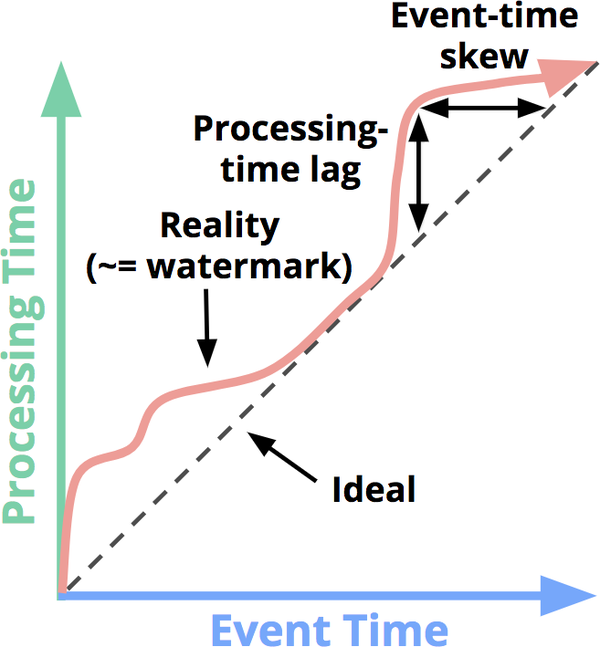
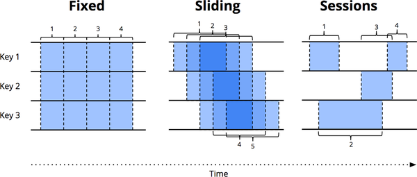

Flink运行架构

## [Flink分层API](https://ci.apache.org/projects/flink/flink-docs-release-1.12/zh/concepts/index.html)

## DataFlow

毫无疑问，Apache Flink 和 Apache Spark （Structured Streaming）现在是实时流计算领域的两个最火热的话题了。那么为什么要介绍 Google Dataflow 呢？***Streaming Systems*** 这本书在分析 Flink 的火热原因的时候总结了下面两点：

> “There were two main reasons for Flink’s rise to prominence:
>
> - Its rapid adoption of the Dataflow/Beam programming model, which put it in the position of being the most semantically capable fully open source streaming system on the planet at the time.
> - Followed shortly thereafter by its highly efficient snapshotting implementation (derived from research in Chandy and Lamport’s original paper “Distributed Snapshots: Determining Global States of Distributed Systems” [Figure 10-29]), which gave it the strong consistency guarantees needed for correctness. ”
>
> 摘录来自: Tyler Akidau, Slava Chernyak, Reuven Lax. “Streaming Systems。”

简单来说一是实现了 Google Dataflow/Bean 的编程模型，二是使用分布式异步快照算法 Chandy-Lamport 的变体。 Chandy-Lamport 算法在本专栏的上一篇文章已经说过了。

Apache Spark 的 2018 年的论文中也有提到

> Structured Streaming combines elements of Google Dataflow [2], incremental queries [11, 29, 38] and Spark Streaming [37] to enable stream processing beneath the Spark SQL API.

所以说，称 Google Dataflow 为现代流式计算的基石，一点也不为过。我们这篇文章就来看一下 Google Dataflow 的具体内容，主要参考于 2015 年发表与 VLDB 的 Dataflow 论文：***The dataflow model: a practical approach to balancing correctness, latency, and cost in massive-scale, unbounded, out-of-order data processing***。

### Dataflow核心模型

Google Dataflow 模型旨在提供一种统一批处理和流处理的系统，现在已经在 Google Could 使用。其内部使用 Flume 和 MillWheel 来作为底层实现，这里的 Flume 不是 Apache Flume，而是 MapReduce 的编排工具，也有人称之为 FlumeJava；MillWheel 是 Google 内部的流式系统，可以提供强大的无序数据计算能力。关于 Google Cloud 上面的 Dataflow 系统感兴趣的可以参考官网链接 [CLOUD DATAFLOW](https://cloud.google.com/dataflow/?hl=zh-cn)。我们这里重点看一下 Dataflow 模型。

Dataflow 模型的核心点在于：

- 对于无序的流式数据提供基于 event-time 的顺序处理、基于数据本身的特征进行窗口聚合处理的能力，以及平衡正确性、延迟、成本之间的相互关系。
- 解构数据处理的四个维度，方便我们更好的分析问题：
  - **What** results are being computed
  - **Where** in event time they are been computed
  - **When** in processing time they are materialized
  - **How** earlier results relate to later refinements

- 将数据处理中的逻辑概念和底层物理实现解耦

具体来说，主要包括以下几部分：

- **Windowing Model**，支持非对齐的 event time 的窗口聚合
- **Triggering Model**，提供强大和灵活的声明式 API 来描述 Trigger 语义，可以根据事件处理的运行时特征来决定输出次数。
- **Incremental Processing Model**，将数据的更新整合到上面的 **Window** 模型和 **Trigger** 模型中。
- **Scalable implementation**，基于 MillWheel 流式引擎和 Flume 批处理引擎实现的 Google Dataflow SDK，用户无需感知底层系统。
- **Core Principle**，模型设计的核心原则。
- 最后是案例分析。

### 核心概念

#### Unbounded/Bounded vs Streaming/Batch

在 Dataflow 之前，对于有限/无限数据集合的描述，一般使用批/流 （Batch/Streaming），总有一种暗示底层两套引擎（批处理引擎和流处理引擎）。对于批处理和流处理，一般情况下是可以互相转化的，比如 Spark 用微批来模拟流。而 Dataflow 模型一般将有限/无限数据集合称为 Bounded/Unbounded Dataset，而 Streaming/Batch 用来特指执行引擎。可以认为批是流的一种特例。

#### 时间语义

在流式处理中关于时间有两个概念需要注意：

- **Event Time**，事件发生的时间。
- **Processing TIme**，事件在系统中的处理时间。

这两个概念非常简单。比如在 IoT 中，传感器采集事件时对应的系统时间就是 Event Time，然后事件发送到流式系统进行处理，处理的时候对应的系统时间就是 Processing Time。虽然是两个很简单概念，但是在 Dataflow 模型之前，很多系统并没有显示区分，比如 Spark Streaming。

在现实中，由于通信延迟、调度延迟等，往往导致 Event Time 和 Processing Time 之间存在差值（skew），且动态变化。skew 一般使用 watermark 来进行可视化，如下图。

那条蜿蜒的红线本质上是水位线，随着处理时间的推移，它描述了事件时间完整性的进度。从概念上讲，可以将水印视为函数*F*（*P*）→ *E*，它在处理时间并返回事件时间点，事件时间*E的*那个点是系统认为事件时间小于*E的*所有输入都被观测到的时间点，换而言之，所有事件时间小于Watermark的数据都已经达到了，而任务在接收到的小于Watermark的数据可称为延迟数据。所以Watermark永远是单调递增的，因为`时光不会倒流`。

#### window

Window，也就是窗口，将一部分数据集合组合起操作。在处理无限数据集的时候有限操作需要窗口，比如 **aggregation**，**outer join**，**time-bounded** 操作。窗口大部分都是基于时间来划分，但是也有基于其他存在逻辑上有序关系的数据来划分的。窗口模型主要由三种：**Fixed Window**，**Sliding Window**，**Session Window**。

- Fixed Window

  Fixed Window ，有时候也叫 Tumbling Window。Tumble 的中文翻译有“翻筋斗”，我们可以将 Fixed Window 是特定的时间长度在无限数据集合上翻滚形成的，核心是每个 Window 没有重叠。比如小时窗口就是 12:00:00 ~ 13:00:00 一个窗口，13:00:00 ~ 14:00:00 一个窗口。从例子也可以看出来 Fixed Window 的另外一个特征：aligned，中文一般称为对齐。

- Silding Window

  Sliding Window，中文可以叫滑动窗口，由两个参数确定，窗口大小和滑动间隔。比如每分钟开始一个小时窗口对应的就是窗口大小为一小时，滑动间隔为一分钟。滑动间隔一般小于窗口大小，也就是说窗口之间会有重叠。滑动窗口在很多情况下都比较有用，比如检测机器的半小时负载，每分钟检测一次。Fixed Window 是 Sliding Window 的一种特例：窗口大小等于滑动间隔。

- Session Window

  Session Window，会话窗口， 会话由事件序列组成，这些事件序列以大于某个超时的不活动间隔终止（两边等），回话窗口不能事先定义，取决于数据流。一般用来捕捉一段时间内的行为，比如 Web 中一段时间内的登录行为为一个 Session，当长时间没有登录，则 Session 失效，再次登录重启一个 Session。Session Window 也是用超时时间来衡量，只要在超时时间内发生的事件都认为是一个 Session Window。

### Dataflow Model

这一节来讨论一下 Dataflow 模型的形式化定义，并解释为什么足够通用，可以同时支持批和流等系统。

#### Core Primitives

Dataflow 针对 (key, value) 数据对提供了两种基本的操作原语：**ParDo** 和 **GroupByKey**。

 

#### 

 

 