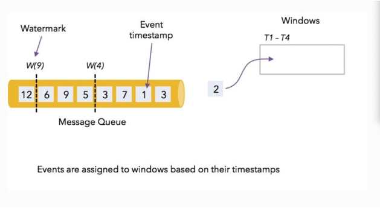
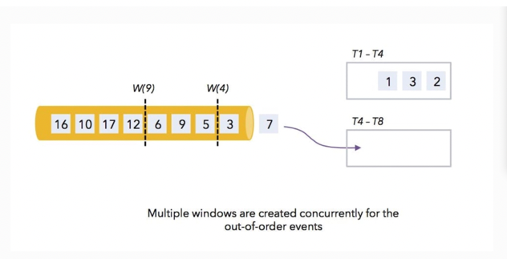
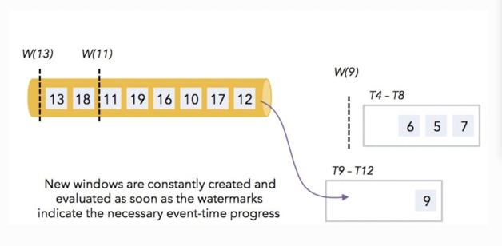
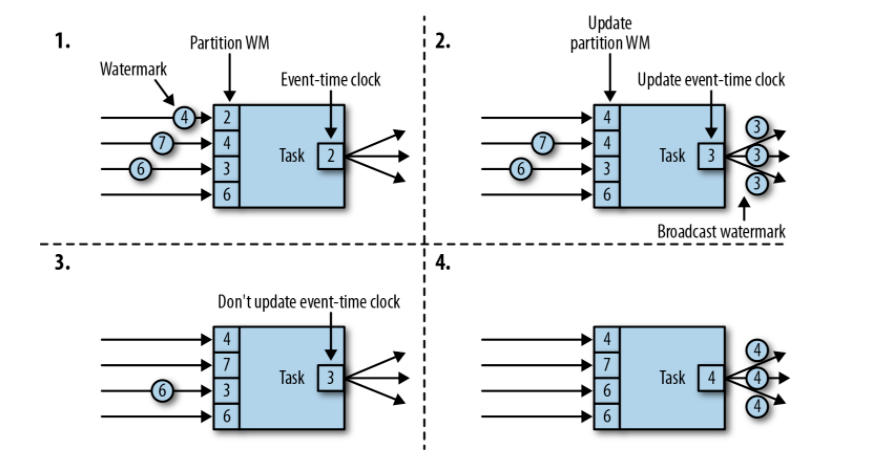

* [Time与Watermark](#time与watermark)
  * [时间语义](#时间语义)
  * [Watermark](#watermark)
    * [Watermark的类型](#watermark的类型)
      * [完美式Watermark](#完美式watermark)
      * [启发式Watermark](#启发式watermark)
    * [Watermark的传递](#watermark的传递)

# Time与Watermark

Dataflow模型从流处理的角度来审视数据处理流程，将批和流处理的数据抽象成数据集的概念，并将数据集划分为无界数据集和有界数据集，认为流处理是批处理的超集。模型定义了时间域（time domain）的概念，将时间明确的区分为事件时间（`event-time`）和处理时间（`process-time`）。

在处理时间中的哪个时刻触发计算结果（When in processing time are results materialized）？=> `watermark`

`Watermark`回答了`When` => 什么时候触发计算。


## 时间语义

在无界数据处理中，主要关注以下两种时间语义:

- Event time: 事件实际发生的时间。
- processing time: 在系统中观测到事件的时间, 也就是时间被处理的时间。

在Flink中定义时间语义:

```scala
// alternatively:
// env.setStreamTimeCharacteristic(TimeCharacteristic.IngestionTime)
// env.setStreamTimeCharacteristic(TimeCharacteristic.EventTime)
```


在理想的情况下，事件时间和处理时间总是相等的，事件发生时立即处理它们。然而，实际情况并非如此，event time和processing time之间的偏差是变化的。所谓乱序，其实是指 Flink 接收到的事件的先后顺序并不是严格的按照事件的 Event Time 顺序排列的。

因此，绘制event time和processing time的一张图，通常会得到下图中的红线的结果。


可以理解为，这条红线本质上就是watermark，可以视为函数*F*（*P*）→ *E*,其中F代表处理时间，E代表事件时间,即我们能够在处理时间点P判定事件时间推进到了E，换而言之，所有事件时间小于E的数据都已经到达了。

## Watermark

先通过一个实际场景来理解watermark是如何工作的:

1. 从kafka消息队列中消费消息，数值代表event time，可以观测到数据是乱序的，W(4) 和 W(9) 代表水位线。flink消费kafka中消息，并定义了基于event time，窗口大小为4s的窗口。

   

2. 事件中event time为1、3、2 的数据进入了第一个窗口，event time为 7 会进入第二个窗口，接着 3 依旧会进入第一个窗口，此时系统watermark >= 第一个窗口entTime，触发窗口计算发出结果。

   

3. 接着的event time为 5 和 6的数据 会进入到第二个窗口里面，数据 9 会进入在第三个窗口里面。 当watermark更新时，触发第二个窗口的计算.

   

### Watermark的类型

#### 完美式Watermark

- 这是理想情况下的watermark，使用完美水位线创建的pipeline从不需要处理延迟数据。也就是说，数据数据源是严格保证有序的，不需要考虑乱序的问题。实际上，完美的watermark对数据源要求比较高，但并不是不存在的，比如canal监控mysql中的Binlog数据，此时Kafka中每个Partition中的数据就是严格有序的。

- Flink中严格水位线的API表达方式:

  ```scala
  env.addSource(new Source).assignAscendingTimestamps(_.ts)
  ```

  

#### 启发式Watermark

- 启发式watermark的概念出自于Dataflow，大部分情况下，数据源都是乱序的，此时watermark机制便是启发式的，它任务event time小于watermark的数据都已经到达，此后到达的event time小于watermark的数据则成为迟到数据。
- 是一种平衡延迟与准确性的一种机制，也就意味着它可能是不准确的。

- Watermark引入：

  ```scala
  env.setStreamTimeCharacteristic(TimeCharacteristic.EventTime)
  
  // 每隔5秒产生一个watermark
  env.getConfig.setAutoWatermarkInterval(5000)
  ```

  产生watermark的逻辑：每隔5秒钟，Flink会调用AssignerWithPeriodicWatermarks的getCurrentWatermark()方法。如果方法返回一个时间戳大于之前水位的时间戳，那么算子会发出一个新的水位线。这个检查保证了水位线是单调递增的。如果方法返回的时间戳小于等于之前水位的时间戳，则不会产生新的watermark。

  从自定义Watermark可以看到，不断获取事件的最大时间戳，周期性调用getCurrentWatermark()返回watermark。

  ```scala
  class PeriodicAssigner extends AssignerWithPeriodicWatermarks[SensorReading] {
    val bound: Long = 60 * 1000 // 延时为1分钟
    var maxTs: Long = Long.MinValue // 观察到的最大时间戳
  
    override def getCurrentWatermark: Watermark = {
      new Watermark(maxTs - bound)
    }
  
    override def extractTimestamp(r: SensorReading, previousTS: Long) = {
      maxTs = maxTs.max(r.timestamp)
      r.timestamp
    }
  }
  ```

- Flink内置Watermark生成器

  ```scala
      env.addSource(FlinkUtils.getFlinkKafkaConsumer())
        .assignTimestampsAndWatermarks(
          new BoundedOutOfOrdernessTimestampExtractor[UserBehavior](Time.seconds(2)) { //设置延时时长
            override def extractTimestamp(t: UserBehavior): Long = t.timestamp
          })
  ```
  
  

### Watermark的传递

- Flink将数据流拆分为多个分区，并通过单独的算子任务并行地处理每个分区（数据并行）。每个分区都是一个流，里面包含了带着时间戳的数据和watermark。一个算子与它前置或后续算子的连接方式有多种情况，所以它对应的任务可以从一个或多个“输入分区”接收数据和watermark，同时也可以将数据和watermark发送到一个或多个“输出分区”。

- 任务为每个输入分区维护一个分区水位线（watermark）。当从一个分区接收到watermark时，它会比较新接收到的值和当前水位值，然后将相应的分区watermark更新为两者的最大值（**`Watermark是单调递增的`**）。然后，任务会比较所有分区watermark的大小，将其事件时钟更新为所有分区watermark的最小值（**`Watermark对齐`**）。如果事件时间时钟前进了，任务就将处理所有被触发的定时器操作，并向所有连接的输出分区发送出相应的watermark，最终将新的事件时间广播给所有下游任务。



- Flink的水位处理和传递算法，确保了算子任务发出的时间戳和watermark是“对齐”的。不过它依赖一个条件，**`那就是所有分区都会提供不断增长的watermark`**。一旦一个分区不再推进水位线的上升，或者完全处于空闲状态、不再发送任何数据和watermark，任务的事件时间时钟就将停滞不前，任务的定时器也就无法触发了。

- 理解这一点非常重要，在生产环境中，消费Kafka中数据，一般来说，任务并行度会设置为与Kafka Partition数量一致，当分区数据倾斜严重时，会严重影响整个任务的计算；**`当某分区没有数据时，整个任务都不会触发计算`**，如果做双流Join，可能会遇到A流Watermark更新，但B流Watermark不更新的情况，导致整个任务停滞不前。所以应该尽量避免这种情况，良好的系统设计才是关键。